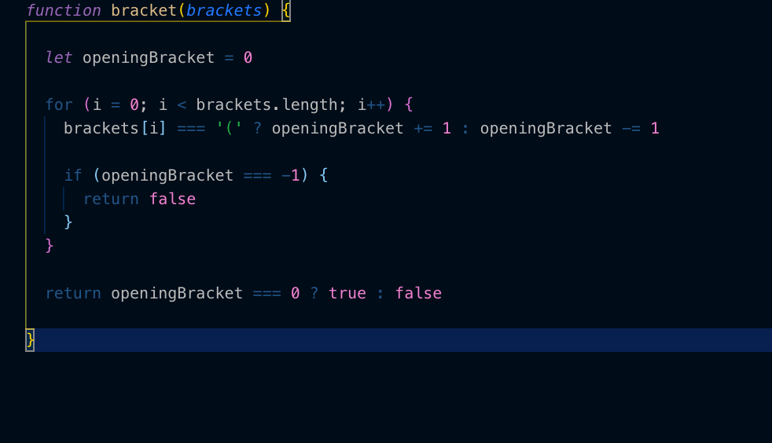

## BRACKET TECH TEST

A big part of the interview process is tech tests. For some of my favourites that I've done I've decided to create git repos and show my workings.

### REQUIREMENTS

Build a function in a language of your choice that, as an input, takes a string. This string will only contain paranthesis'. The function must return true if every opening paranthesis has a closing bracket

### INPUT/OUTPUT

| Input         | Output        |
| ------------- |---------------|
| '()' | True |
| '((()))' | True |
| '(()()())' | True |
| '((())())' | True |
| '((((' | False |
| ')(' | False |

### TESTING

I used Jasmine as my testing framework as I was working in Javascript

### SCREENSHOTS

My code for the tech test

The tests

Passing Tests

